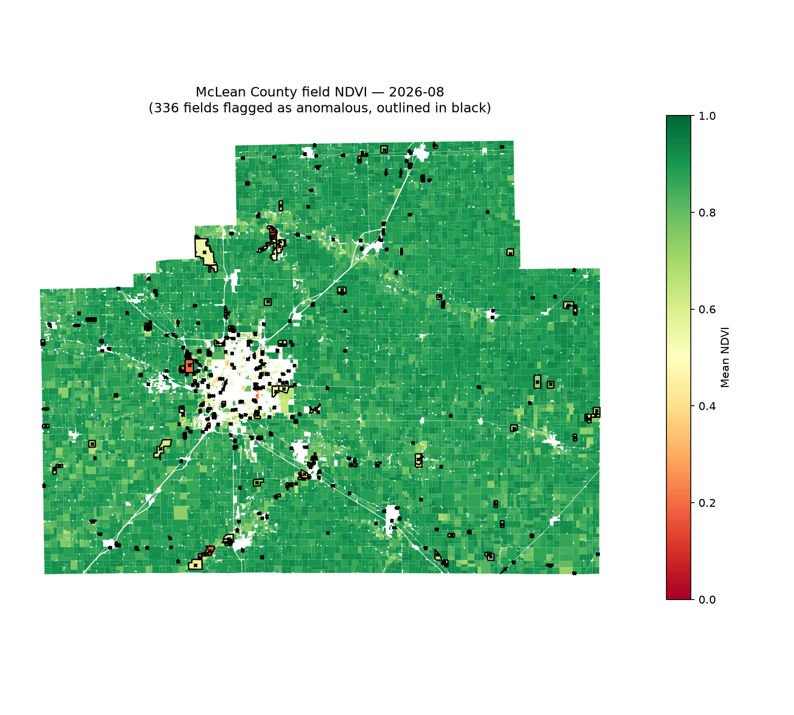
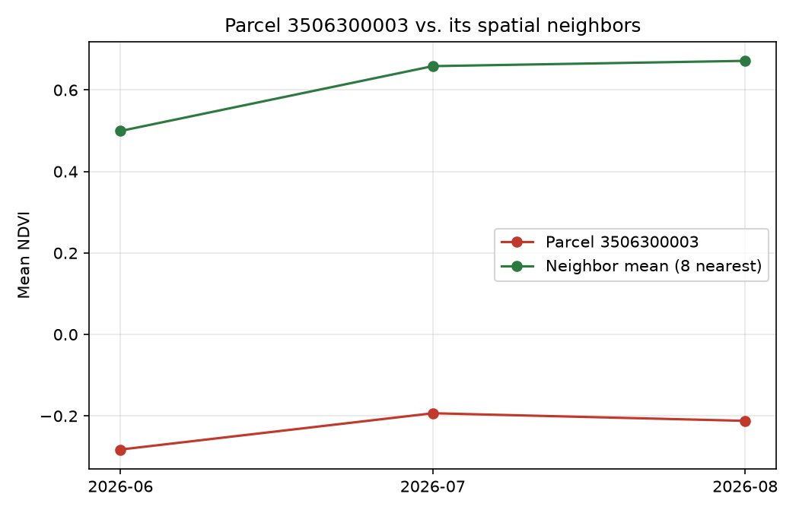
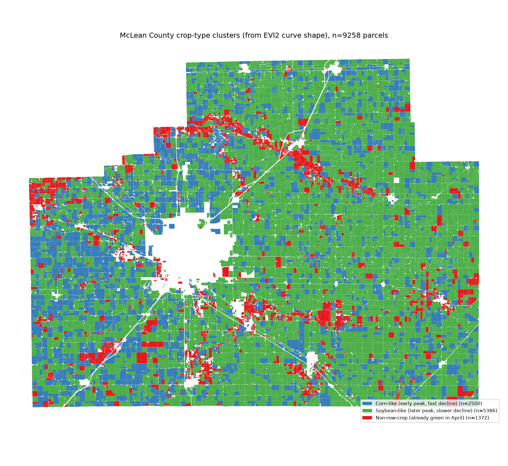

# NDVI Field Monitoring — Python + PostGIS

A small, complete pipeline for detecting crop stress: pull Sentinel-2 imagery,
compute NDVI, intersect it with field boundaries, and flag fields whose NDVI
is anomalous relative to their spatial neighbors — the same shape of problem
as continental-scale agricultural monitoring, run here on one county so the
whole thing is reviewable in one sitting.

This is a batch pipeline run on demand, not a live service — there's no
backend, and the map on GitHub Pages is a static snapshot of one run's
output, not a live query. Making "pick any county on a map" work on demand
would mean solving nationwide parcel-data sourcing (every county runs its
own GIS portal, no unified free source) and standing up a real hosted
backend — a genuinely different, larger project than this one, which is
deliberately scoped to one county done well rather than a platform.



Every polygon is a real McLean County parcel, colored by its August mean
NDVI; the black-outlined ones are fields flagged as anomalous relative to
their spatial neighbors (see [Results](#results)). The blank area in the
middle is Bloomington-Normal — it drops out on its own because the >10-acre
parcel filter excludes town lots. An interactive version
(`reports/county_ndvi_map.html`, pan/zoom/click any parcel for its NDVI and
anomaly flag, satellite basemap toggle for ground-truthing) is generated
alongside this one by `src/visualize.py`.

Ground-truthing the flagged parcels against satellite imagery turns up
exactly what you'd expect from a >10-acre parcel filter with no land-use
attribute to screen on: golf courses, cemeteries, quarries, detention
ponds — and the Rivian plant in Normal (a multi-hundred-acre former auto
plant, now flat pavement and rooftop where the parcel data has no way to
know that isn't a field). None of these are pipeline bugs; they're the
correct output of "large parcel, doesn't green up like its neighbors,"
which just isn't the same claim as "cropland in distress." A production
version would cross-reference land-use/zoning data to exclude non-
agricultural parcels before flagging; this one surfaces them and leaves the
judgment call visible instead of hiding it.



The field above sits flat around -0.2 to -0.3 NDVI across three months while
its eight nearest neighbors follow the expected green-up curve
(0.50 → 0.66 → 0.67). That flat, never-greens-up shape is water or bare
ground, not a struggling crop — real crop stress still tracks the season,
just below its neighbors.

## Why Python *and* PostGIS

Most geospatial pipelines are Python end-to-end: read raster, load vector
into geopandas, do everything in memory. That's fine at small scale, but it
throws away a tool that's actually a better fit for part of the problem.

This project draws the line deliberately:

- **Python (`rasterio`) owns the raster side.** Reading satellite bands and
  computing NDVI is array math over pixel grids — `rasterio`/`numpy` are the
  right tool, and there's no reason to reach for anything else.
- **PostGIS owns the vector and spatial-analysis side.** Polygon storage,
  neighbor comparison, and the resulting per-field statistics are set-based
  operations over relational data with a natural index (`GIST`). At one
  county this barely matters; at the scale this pipeline is modeling
  (thousands of fields, daily imagery, multi-state) it's the difference
  between a spatial join that uses an index and one that doesn't. Pushing
  this logic into the database rather than pulling every geometry into
  `geopandas` and looping in Python is the same call made for the original
  20-state pipeline this project is a slice of.

The dividing line is: **arrays stay in Python, geometries stay in the
database.** Zonal statistics (step 4) sits right on that boundary — the
raster stays in Python because rasterizing polygons against a pixel grid
needs the array, but the *result* (one NDVI scalar per field per date) is a
tabular fact and gets written back to PostGIS immediately, because the next
step needs to join it against spatial neighbors. See
[`src/zonal_stats.py`](src/zonal_stats.py) for the full reasoning.

Step 5 (neighbor comparison) is where the PostGIS side does the most real
work: finding each field's nearest neighbors uses the idiomatic
GIST-accelerated KNN pattern (`LATERAL` join, `ORDER BY geometry <-> geometry
LIMIT k`) — confirmed via `EXPLAIN` to hit an Index Scan, not a sequential
scan, over 9,578 parcels. Doing the equivalent in geopandas means either the
full O(n²) pairwise distance matrix or hand-rolling a KD-tree; in PostGIS
it's the query planner's job and a five-line query.

## Pipeline

| Step | What | Where |
|---|---|---|
| 1 | Pull + composite Sentinel-2 imagery for the study area | [`src/fetch_imagery.py`](src/fetch_imagery.py) |
| 2 | Compute NDVI from red/NIR bands | [`src/compute_ndvi.py`](src/compute_ndvi.py) |
| 3 | Load parcel boundaries into PostGIS | [`src/load_boundaries.py`](src/load_boundaries.py) |
| 4 | Zonal statistics: mean NDVI per field per date | [`src/zonal_stats.py`](src/zonal_stats.py) |
| 5 | Neighbor comparison via GIST-accelerated KNN (`<->`) | [`src/neighbor_comparison.py`](src/neighbor_comparison.py) |
| 6 | Time series + anomaly flag | [`src/anomaly.py`](src/anomaly.py) |
| 7 | This README | — |
| — | County map (static + interactive), the payoff of 4-6 | [`src/visualize.py`](src/visualize.py) |
| — | Crop-type curve-shape clustering (subset area) | [`src/fetch_timeseries.py`](src/fetch_timeseries.py), [`src/fetch_hls.py`](src/fetch_hls.py), [`src/clip_parcels.py`](src/clip_parcels.py), [`src/crop_clusters.py`](src/crop_clusters.py), [`src/visualize_subset.py`](src/visualize_subset.py) — see [below](#crop-type-exploration-subset-area) |

## Study area

**McLean County, IL** (Bloomington-Normal) — corn/soybean country, chosen for
Sentinel-2 coverage and a public county parcel dataset. It also happens to
straddle four Sentinel-2 MGRS tiles, which turned into the most useful
accident of the project (see [Real-world gotchas](#real-world-gotchas)).

Field boundaries come from McLean County's public parcel layer (McLean
County GIS Consortium, CC BY 4.0), filtered to parcels over 10 acres —
~9,578 of the county's ~71,000 parcels — to approximate field-scale
agricultural land rather than every residential lot in Bloomington-Normal.
True USDA CLU (Common Land Unit) boundaries aren't publicly redistributable;
they require an FSA data request tied to a specific use case. Parcel data is
the practical public substitute, and this particular layer only carries a
parcel ID and acreage — no owner name or address — which keeps it
comfortably in open-data territory.

## Setup

```bash
# Python environment (conda-forge — geopandas/rasterio's GDAL deps are much
# less painful this way than plain pip on Windows)
conda env create -f environment.yml
conda activate ndvi-postgis

# PostGIS, via Docker
docker compose up -d
cp .env.example .env
```

Run the pipeline (each step takes an optional date label; `2026-06`,
`2026-07`, `2026-08` are the three months already loaded):

```bash
python -m src.fetch_imagery "2026-08-01/2026-08-31" 2026-08
python -m src.compute_ndvi 2026-08
python -m src.load_boundaries        # once — parcels don't change month to month
python -m src.zonal_stats 2026-08
python -m src.neighbor_comparison 2026-08
python -m src.anomaly
python -m src.visualize 2026-08   # writes reports/county_ndvi_map.{png,html}
```

## What NDVI measures, and why neighbor comparison matters

NDVI = (NIR − Red) / (NIR + Red). Healthy, chlorophyll-rich canopy absorbs
red light for photosynthesis and strongly reflects near-infrared, so dense
vegetation reads close to +1; bare soil, water, and stressed or absent
canopy read near 0 or negative.

An absolute NDVI threshold doesn't work as an anomaly signal because the
county's NDVI floor moves with the season and the weather — corn at
knee-high in June reads nothing like corn at full canopy in August, and a
regional dry spell suppresses NDVI everywhere at once. "This field is below
0.5" is ambiguous; it could mean stressed crop, or it could mean every field
in the county is at 0.5 that week. **Comparing a field to its immediate
spatial neighbors cancels out the shared regional signal** — weather, planting
date for the area, satellite viewing geometry — and leaves the field-specific
difference, which is the thing actually worth flagging.

## Results

Three monthly composites (June/July/August 2026) over 9,578 parcels:

| Month | Avg. field NDVI | Avg. neighbor-mean NDVI |
|---|---|---|
| 2026-06 | 0.628 | 0.627 |
| 2026-07 | 0.745 | 0.747 |
| 2026-08 | 0.860 | 0.862 |

That progression is the expected corn/soybean canopy-closure curve, and
field vs. neighbor-mean track within 0.002 of each other county-wide — the
neighbor baseline is doing its job as a shared reference, not just adding
noise.

**Anomaly flag:** z-score each field's deviation from its neighbor mean
(`ndvi_diff`) against the distribution of that same deviation across all
fields *on that date*, and flag `z < -2`. A single flagged date is treated
as a one-off (cloud contamination, a registration nudge between mosaic
tiles, a field cut that week); a field flagged on **every** date observed is
reported as a persistent anomaly — the stronger, still-simple signal.
**41 of 9,566 fields (0.4%)** are persistent anomalies across the three
months. The chart at the top of this README is the strongest one
(avg. z = −7.4).

## Real-world gotchas

Two things showed up building this against actual imagery that a
single-scene, single-tile toy version wouldn't have surfaced, and both
seemed more useful to fix properly and document than to route around:

- **A county doesn't fit in one tile.** McLean County straddles four
  Sentinel-2 MGRS tiles (16TBK/BL/CK/CL). Picking "the least-cloudy single
  scene" silently produced a mosaic covering less than half the county —
  the fix is mosaicking all four tiles for a date, not picking one scene.
- **A tile "existing" for a date doesn't mean it has full data over the
  AOI.** Individual Sentinel-2 passes can have large nodata gaps from swath
  edges — `s2:nodata_pixel_percentage` on one tile swung from 0% to 78%
  across a few weeks. Requiring a single date with all four tiles clean
  turned out to not exist for most of the growing season. The fix is a
  standard best-pixel composite: rank candidate acquisitions per tile by
  nodata%, then cloud%, and mosaic best-first so gaps in the top choice get
  filled from the next-best acquisition of that same tile.

Separately, the real county parcel data included 5 self-intersecting
geometries out of 9,578 — `ST_MakeValid` runs automatically after load so
`ST_Intersects`/KNN don't choke on them downstream.

## Crop-type exploration (subset area)

A follow-on question from the anomaly work: can NDVI curve *shape* — not
just level — distinguish what's actually growing in a field? Corn and
soybean have different phenology (corn greens up faster and peaks earlier;
soybean climbs more gradually and peaks later), which is the same signal
USDA's own Cropland Data Layer is built on. Scoped to a small rural subset
(122–163 parcels, depending on date coverage) rather than the full county,
since this needs every available date across the season, not monthly
composites — [`src/fetch_timeseries.py`](src/fetch_timeseries.py) and
[`src/fetch_hls.py`](src/fetch_hls.py) for imagery,
[`src/clip_parcels.py`](src/clip_parcels.py) for the road/waterway
correction below, [`src/crop_clusters.py`](src/crop_clusters.py) for the
clustering, [`src/visualize_subset.py`](src/visualize_subset.py) for the map.

**[Interactive map](https://chrisgoldsmith1990.github.io/ndvi-postgis-pipeline/reports/subset_crop_map.html)** —
tap any parcel for its NDVI curve, behavioral cluster, and an assignment
confidence.

Only 8 of 41 candidate Sentinel-2 passes were clear enough to use at first,
leaving a 45-day blind gap (May 9 → June 23) across almost the entire
green-up transition — enough to say *when* a field peaked, but not whether
it got there in a burst or a steady climb. Loosening the cloud threshold
recovered two dates inside that gap (and caught one bad one: a scene that
passed the pixel-level cloud check but showed whole-scene residual haze —
excluded explicitly, see `crop_clusters.BAD_DATES`). With real data inside
the gap, the shape difference is stark and quantitative: from an
almost-identical starting point in mid-May, the corn-like cluster reaches
97% of its season peak by June 23, while the soybean-like cluster has only
reached 67% of its (higher) peak by the same date and keeps climbing for
another two months. Clusters are unsupervised and reported as behavioral
groups, not validated crop labels — no ground truth exists for this
subset. (USDA's CDL would be the obvious cross-check, but it lags a full
year behind the crop it describes — the newest available CDL right now is
for last year, not this year — and corn/soybean rotation means a
year-old label can be wrong for the current season on any given field.
That's a real constraint on validating this, not an oversight.)

**Densifying with a second sensor** ([`src/fetch_hls.py`](src/fetch_hls.py)) —
Sentinel-2 alone only cleared 8 usable dates out of 41 candidate passes this
season. NASA's Harmonized Landsat Sentinel-2 (HLS) product is built
specifically to be numerically comparable to Sentinel-2 surface
reflectance and shares its MGRS tiling, so NDVI from either sensor slots
into the same time series without rescaling. Adding HLS-L30 (Landsat)
recovered 8 more usable dates — nearly doubling the season to 18 —
including one right inside what was previously a blind gap, and two
adjacent-day cross-sensor pairs that agree almost exactly (Aug 22
Sentinel-2 vs. Aug 23 Landsat: 0.895 vs. 0.894 mean NDVI).

Getting there required diagnosing a real, non-obvious bug: `rasterio`/GDAL's
generic HTTP streaming driver hangs indefinitely on Azure Blob Storage's
SAS-token-authenticated URLs (Planetary Computer's access method for HLS),
ignoring configured timeouts — confirmed by isolating each step (a plain
STAC search and a plain token-signing request both complete in under a
second on their own; only `rasterio.open()` on the signed URL itself
hangs). The fix: download each band fully via plain `requests` first, then
open the local file with `rasterio`, sidestepping GDAL's streaming path
entirely. Also worth noting: HLS surface reflectance occasionally produces
individual pixels with NDVI outside the theoretically valid [-1, 1] range
(atmospheric-correction artifacts at dark/shadow-edge pixels) — `compute_ndvi.py`
now clips to that range, though empirically it never changed a parcel's
zonal mean for this dataset; the artifact pixels are too few to move an
average of hundreds.

Honest result of the density increase: real curve texture is visible now
that wasn't with 8-10 sparse points (a shared dip across all three
clusters around day 165-170, likely an actual short-term weather effect,
not a fitting artifact) — the corn/soybean early-vs-late-peak story still
holds directionally. But the aggregate silhouette score actually *dropped*
slightly (0.385 → 0.338) rather than improving. More temporal resolution
made the picture more detailed, not more separable — combining two
sensors' worth of real day-to-day variation adds genuine texture that a
clean 3-cluster model doesn't perfectly capture. Reported as-is rather
than only reporting the version that looked best.

**Yield ranking** ([`src/yield_ranking.py`](src/yield_ranking.py)) —
ranks each parcel's season-integrated NDVI against others in its own
crop-type cluster, the same neighbor-relative logic the anomaly detector
uses, applied to a crop-type peer group instead of a spatial one. An
approximate bu/ac rate is also computed, anchored to McLean County's
actual 2025 NASS yield (243.1 bu/ac corn, 73.95 bu/ac soybean) and scaled
by real published models' coefficient of variation (Johnson et al. 2021,
*Remote Sens.* 13(21):4227 — Illinois-level accumulated-NDVI R²=0.91 for
corn, only R²=0.54 for soybean) — but the rate alone isn't the estimate
that matters, since parcels in this subset range from a dozen to well
over a hundred acres. The actual reported estimate is **total bushels**:
that rate multiplied by the parcel's *clipped* acreage (see below — the
crop-growing area with roads/waterways subtracted out, not the county's
raw deeded acreage). This is explicitly an approximation — it borrows a
cited relationship's *spread*, not a fitted equation specific to this
subset — and should be trusted much less for the soybean-like majority of
parcels than for the corn-like ones, per the source paper's own finding.

**Road/waterway clipping** ([`src/clip_parcels.py`](src/clip_parcels.py)) —
a parcel's tax-boundary polygon can include a road or stream running
through the field itself, and those pixels read as pavement or water, not
crop, dragging the zonal-stats NDVI mean along with them. Real, not
hypothetical: the subset area has 44 actual OpenStreetMap road/waterway
segments crossing its ~163 parcels. Fetches them from OSM's public
Overpass API, buffers each by an approximate right-of-way/channel width
(class-based assumptions — OSM doesn't carry real width for rural roads),
and subtracts the union from every parcel via PostGIS `ST_Difference` into
a `parcels_clipped` table — the same "PostGIS does the spatial-set work"
split used everywhere else here.

The effect is real and physically sensible, confirmed by comparing
clipped vs. unclipped NDVI directly: in spring (bare soil), clipping
*lowers* the mean slightly — removing already-green ditch-bank vegetation
from an otherwise bare field; in summer (mature canopy), clipping
*raises* it — removing low-NDVI pavement from a green field. One small
parcel where a road/stream eats 7.5% of its area shows up to a 0.049 NDVI
shift depending on date. But rerunning the full clustering pipeline on
clipped vs. unclipped data reassigns only 2 of 125 parcels and leaves
silhouette/confidence essentially unchanged — the correction matters for
per-parcel precision (and now feeds the yield estimate's acreage), not
for the aggregate corn/soybean story, which turns out to be robust to it.
`ndvi_zonal_stats_subset_clipped` is now the default the crop-type
pipeline reads from.

## Scaling the crop-type pipeline to all of McLean County

Everything above ran on a ~163-parcel subset to keep per-acquisition-date
fetching cheap. Running the same pipeline — imagery, clipping, clustering,
yield ranking — against all **9,571** county parcels (fetch scope: all
four Sentinel-2/HLS MGRS tiles covering the county, not one) surfaced
three real bugs that the subset was too small and too uniform to expose.

**[Interactive map](https://chrisgoldsmith1990.github.io/ndvi-postgis-pipeline/reports/county_crop_map.html)** —
same per-parcel click popup as the subset map (NDVI curve, cluster label,
assignment confidence, yield estimate), scaled to all 9,571 county
parcels. An earlier version of this section assumed that would balloon to
several hundred MB and shipped a static PNG instead; measured directly,
it's ~34MB — large, but this codebase already had its own precedent that
size range works fine (`visualize.py`'s county-wide anomaly map embeds a
full per-parcel NDVI series for the same ~9,571 parcels at ~7MB), so the
estimate was revised rather than trusted unchecked.
`src/visualize_county_crops.py` still also renders the plain static
choropleth below, as a lightweight fallback for the README itself.

**Bug 1 — whole-AOI cloud rejection discarded far more than it should have.**
`fetch_timeseries.py`'s per-date cloud check averaged bad-pixel fraction
across the *entire* bounding box before deciding whether to keep that
date at all. At subset scale (an 8km box) that's a reasonable proxy — a
cloud covering over a third of it plausibly means the whole small area is
compromised. At county scale (68×53km) it's wrong: a cloud sitting over
one third of the county could push the whole-AOI average over threshold
and discard *every* parcel's data for that date, including parcels sitting
in perfectly clear sky on the other side of the county. Caught by a direct
question about exactly this ("are we throwing out the whole county when we
hit that threshold?") rather than found by inspection. Fixed by raising
the whole-AOI threshold to 0.9 (reject only near-total cloud cover) for
county-scale runs and letting the existing per-pixel masking do the real
filtering — `rasterstats`' NaN-aware zonal averaging already excludes only
the pixels actually under cloud, per parcel. Result: 43 of 72 candidate
dates recovered, versus 11 of 72 before the fix.

**Bug 2 — a strict shared-date requirement no longer made sense once
rejection became per-pixel.** With the fix above, individual parcels
genuinely do end up with different numbers of usable dates now (per-date
valid coverage across the county ranged from ~2,000 to ~9,565 of 9,571
parcels, depending on where that day's clouds happened to sit) —
`crop_clusters.fit_splines()` used to require every parcel share the exact
same global date list (`.dropna()` on a complete-case pivot), which was
fine when a whole-AOI check meant every date either cleared for everyone
or nobody. Fixed by fitting each parcel's PCHIP curve on its own valid
dates instead, excluding a parcel outright only if it has fewer than 6
valid dates or less than 60 days of season span — rather than requiring
one shared date set for all 9,571 parcels, which would mean dropping
almost every parcel or almost every date. (Checked first that this
wasn't hiding a coverage gap: every kept parcel's own date range actually
spans April–September, not just some narrow mid-season window — the
60-day-span floor isn't doing the real work here, per-parcel valid-date
count is.)

**Bug 3 — one joint clustering pass couldn't find both real splits at
county scale.** The first county-wide run produced two clusters and
identified *zero* parcels as corn-like — implausible for a county that's
close to half corn by actual harvested acreage (318,000 corn vs. 294,000
soybean acres, 2025 NASS). The cause: silhouette-based k-selection over
the whole population picked k=2, and the strong, high-variance
already-green-in-April (non-row-crop) split dominated that choice over
the comparatively subtler corn/soybean peak-timing split, lumping every
row-crop parcel into one undifferentiated group. Confirmed by re-running
KMeans on just the row-crop parcels in isolation, which cleanly recovered
two peak-timing clusters (~day 199 and ~day 232 mean peak — consistent
with corn peaking first). Fixed by splitting the clustering into two
explicit stages: a deterministic `early_ndvi` threshold pulls out
non-row-crop first (the same rule the cluster-labeling step already used
to *name* clusters after the fact — now it also performs the split, not
just the naming), then only the remaining row-crop parcels go through
KMeans to find the corn/soybean split. An earlier attempt used a forced
k=2 KMeans fit to *find* the non-row-crop split instead of a fixed
threshold; that fixed the county run but split on an unrelated axis
entirely at the smaller subset scale, leaving almost nothing for the
second stage — the deterministic threshold is what actually generalizes
across both scales.

**Result:** 3,641 corn-like, 4,379 soybean-like, 1,545 non-row-crop, out
of 9,565 clustered parcels (6 more excluded by the date-coverage
thresholds above) — a near-even row-crop split consistent with the
county's real acreage.


